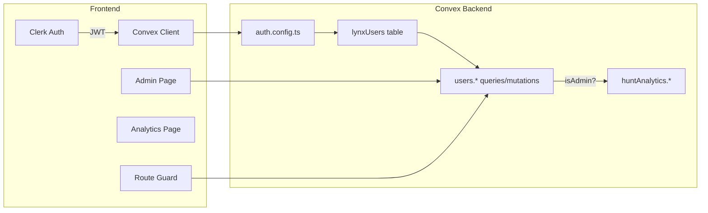

# Admin Page and Role-Based Access Plan

## Current state

- **Auth**: Clerk ([src/main.tsx](src/main.tsx)) for sign-in; Convex has **no** auth integration yet (no `auth.config.ts`, no `ConvexProviderWithClerk`, so `ctx.auth` is never set).
- **Data**: Convex schema ([convex/schema.ts](convex/schema.ts)) has no users table; no user identity is stored.
- **Routes**: React Router in [src/App.tsx](src/App.tsx); [LynxHeader](src/components/LynxHeader.tsx) exposes nav for Procurement, System prompts, Analytics (no Admin).
- **Analytics**: [AnalyticsPage](src/pages/AnalyticsPage.tsx) at `/analytics`; [convex/huntAnalytics.ts](convex/huntAnalytics.ts) has no auth or role checks.

To support “list Clerk users and elevate/demote” and “mark functionality as admin-only,” the app needs identity in Convex and a single source of truth for roles.

---

## Architecture overview

- Clerk issues JWTs; Convex validates them and exposes `ctx.auth.getUserIdentity()` (e.g. `subject` = Clerk user ID, `email`, `name`).
- A **lynxUsers** table in Convex stores `clerkUserId` (or `tokenIdentifier`), display name, and **role** (`"admin"` | `"user"`). This is the source of truth for “who is admin in Lynx.”
- **User list on Admin**: Either (1) only users who have signed in at least once (they get a row in Convex via a “store me” mutation), or (2) full Clerk list via a Convex **action** that calls Clerk Backend API and merges with Convex roles. Plan assumes (1) for simplicity; (2) can be added later.
- **Admin-only features**: Central “is current user admin?” check in Convex; route guard and nav hiding in the app; backend enforcement on sensitive queries/mutations (e.g. analytics).

---

## 1. Convex + Clerk auth setup

- **convex/auth.config.ts**  
  - Add Clerk as provider using `process.env.CLERK_JWT_ISSUER_DOMAIN` (Clerk Frontend API URL) and `applicationID: "convex"`.  
  - Document in README or `.env.example`: set `CLERK_JWT_ISSUER_DOMAIN` in Convex dashboard (and locally if needed) and run `npx convex dev` / `npx convex deploy` after adding.
- **Frontend**  
  - Replace `ConvexProvider` with `ConvexProviderWithClerk` from `convex/react-clerk`, passing `useAuth` from `@clerk/react`.  
  - Keep `ClerkProvider` wrapping Convex (as today).  
  - No new npm packages required; `convex/react-clerk` is part of the Convex React client.
- **Identity in Convex**  
  - After this, Convex functions can use `await ctx.auth.getUserIdentity()` (e.g. `subject` for Clerk user ID, `email`, `name`). Use `subject` as the stable user id for the Lynx users table.

---

## 2. Users table and role storage

- **Schema** ([convex/schema.ts](convex/schema.ts))  
  - New table, e.g. **lynxUsers** (or `users`):  
    - `clerkUserId: v.string()` (map from `identity.subject`)  
    - `name: v.optional(v.string())`  
    - `email: v.optional(v.string())`  
    - `role: v.union(v.literal("admin"), v.literal("user"))`  
    - `updatedAt: v.number()`
  - Index: `by_clerkUserId` on `["clerkUserId"]` for lookups and uniqueness.
- **Bootstrap first admin**  
  - Option A (recommended): Convex dashboard env var, e.g. `LYNX_FIRST_ADMIN_CLERK_ID`, set to the Clerk user ID of the first admin. In the mutation that creates/updates a user row, if the table has no admin yet and the current user’s `subject` equals `LYNX_FIRST_ADMIN_CLERK_ID`, set `role: "admin"`.  
  - Option B: One-off seed script or manual Convex dashboard edit to set one user’s `role` to `"admin"`.  
  - Document how to get the first admin Clerk ID (e.g. from Clerk Dashboard or from a temporary “debug” display of `identity.subject` in the app).

---

## 3. Convex users module (queries/mutations)

- **convex/users.ts** (or similar)  
  - **ensureMe** (mutation, no args):  
    - Get identity via `ctx.auth.getUserIdentity()`; if null, throw.  
    - Upsert row in lynxUsers by `clerkUserId` (= `identity.subject`), set name/email from identity, default `role: "user"`, update `updatedAt`.  
    - Bootstrap: if no admin exists and `identity.subject === process.env.LYNX_FIRST_ADMIN_CLERK_ID`, set `role: "admin"`.
  - **getMyRole** (query):  
    - Identity from `ctx.auth.getUserIdentity()`.  
    - Look up lynxUsers by `clerkUserId`; return `{ role: "admin" | "user" }` or `null` if not found (e.g. not yet ensured).
  - **listForAdmin** (query):  
    - Require current user to be admin (helper: get user by identity.subject, check role; throw if not admin).  
    - Return list of lynxUsers (e.g. clerkUserId, name, email, role, updatedAt) for the Admin page.
  - **setRole** (mutation, args: `clerkUserId: v.string()`, `role: v.union(v.literal("admin"), v.literal("user"))`):  
    - Require current user to be admin.  
    - Find lynxUsers row by `clerkUserId`; if found, patch `role` and `updatedAt`; optionally prevent demoting the last admin (business rule: at least one admin).

Use a small helper in this file, e.g. `requireAdmin(ctx)`, that gets identity, looks up user, throws if not admin, so all admin-only functions call it.

---

## 4. Store current user on sign-in (client)

- **useStoreUserEffect** (or equivalent)  
  - When Convex auth is authenticated (`useConvexAuth().isAuthenticated`), call `ensureMe` once so the current user has a lynxUsers row (and thus a role).  
  - Use `useEffect` with dependency on `isAuthenticated` (and optionally `user?.id` from Clerk) so it runs after login and when switching accounts.
- **App entrypoint**  
  - Call this hook at the top level (e.g. in [App.tsx](src/App.tsx) or a layout that wraps authenticated routes) so any role-dependent UI (Admin link, Analytics guard) sees the user as “stored” and can call `getMyRole` safely.

---

## 5. Admin page UI

- **Route**: Add `/admin` in [App.tsx](src/App.tsx), e.g. `<Route path="/admin" element={<AdminPage />} />`.  
- **AdminPage** ([src/pages/AdminPage.tsx](src/pages/AdminPage.tsx)):  
  - Use `useQuery(api.users.listForAdmin)`.  
  - If query returns undefined (loading), show loading.  
  - If query throws or returns “not admin,” redirect to home (or show “Access denied”) and do not render the list.  
  - Otherwise render a table (or list) of users: clerkUserId (or email/name), current role, and actions “Elevate to admin” / “Demote to user” that call `setRole` with the chosen role.  
  - Optionally: disable “Demote” for the current user or enforce “at least one admin” in the mutation and show a message if demotion fails.
- **LynxHeader**: Add “Admin” to [LynxHeader](src/components/LynxHeader.tsx) with `activePage` type extended to include `"admin"`. Show the Admin link only when `getMyRole` returns `"admin"` (e.g. via a small hook or wrapper that reads `useQuery(api.users.getMyRole)`).

---

## 6. Admin-only functionality and route guard

- **Central “admin-only” definition**  
  - For clarity, introduce a single place that defines which routes are admin-only, e.g. a constant in the app:  
    - `ADMIN_ONLY_ROUTES = ["/admin", "/analytics"]` (or route path list).
  - Use this for both the route guard and for hiding nav links (Analytics, Admin).
- **Route guard component**  
  - Create a wrapper (e.g. `AdminOnlyRoute`) that:  
    - Uses `useQuery(api.users.getMyRole)`.  
    - If loading, show a short loading state.  
    - If not admin (null or role !== "admin"), redirect to `/` (or a “Access denied” page).  
    - If admin, render `children` (the actual route component).
  - In [App.tsx](src/App.tsx), wrap `/admin` and `/analytics` with this guard, e.g.  
    - `<Route path="/admin" element={<AdminOnlyRoute><AdminPage /></AdminOnlyRoute>} />`  
    - `<Route path="/analytics" element={<AdminOnlyRoute><AnalyticsPage /></AdminOnlyRoute>} />`
- **LynxHeader**  
  - For “Analytics” and “Admin”: only render the nav link when `getMyRole` is `"admin"`.  
  - This keeps the nav in sync with the route guard and avoids showing links that would redirect.
- **Backend enforcement**  
  - **huntAnalytics**: In [convex/huntAnalytics.ts](convex/huntAnalytics.ts), for `getHuntCountsByState`, add a check at the start: ensure the caller is admin (e.g. reuse the same `requireAdmin`-style helper from users module, or a shared helper). If not, throw so the analytics page cannot be used by non-admins even if they hit the API directly.  
  - Optionally: keep `recordHuntStarted` as-is (all signed-in users) or restrict later; the plan focuses on “view analytics” as admin-only.

---

## 7. “Mark functionality as admin-only” (extensible)

- **Current scope**: Analytics and Admin are admin-only via the guard and backend check above.  
- **Future**: To mark more features as admin-only without changing many files:  
  - Either keep the constant list of admin-only paths and add new paths there, or  
  - Add a small Convex table (e.g. `featureFlags` or `adminOnlyFeatures`) with a list of feature keys and have the guard/header resolve “is this route admin-only?” from that table. For this plan, the constant list is enough; the table can be a follow-up.

---

## 8. Files to add or change (summary)

| Area                                                           | Action                                                                                              |
| -------------------------------------------------------------- | --------------------------------------------------------------------------------------------------- |
| [convex/auth.config.ts](convex/auth.config.ts)                 | **Add** – Clerk provider with `CLERK_JWT_ISSUER_DOMAIN`.                                            |
| [convex/schema.ts](convex/schema.ts)                           | **Add** – lynxUsers table and index.                                                                |
| convex/users.ts                                                | **Add** – ensureMe, getMyRole, listForAdmin, setRole, requireAdmin helper.                          |
| [src/main.tsx](src/main.tsx)                                   | **Change** – Use ConvexProviderWithClerk + useAuth from @clerk/react.                               |
| src/hooks/useStoreUserEffect.ts (or similar)                   | **Add** – Call ensureMe when authenticated.                                                         |
| [src/App.tsx](src/App.tsx)                                     | **Change** – use store-user effect; add /admin route; wrap /admin and /analytics in AdminOnlyRoute. |
| src/pages/AdminPage.tsx                                        | **Add** – List users, elevate/demote via setRole.                                                   |
| src/components/AdminOnlyRoute.tsx (or RouteGuard)              | **Add** – getMyRole + redirect if not admin.                                                        |
| [src/components/LynxHeader.tsx](src/components/LynxHeader.tsx) | **Change** – getMyRole; show Analytics and Admin links only for admins; add activePage "admin".     |
| [convex/huntAnalytics.ts](convex/huntAnalytics.ts)             | **Change** – Require admin in getHuntCountsByState.                                                 |
| Docs / .env.example                                            | **Update** – Document CLERK_JWT_ISSUER_DOMAIN and LYNX_FIRST_ADMIN_CLERK_ID.                        |

---

## 9. Optional: Full Clerk user list (later)

If you want the Admin page to show **all** Clerk users (including those who never signed in to Lynx):  

- Add a Convex **action** that uses the Clerk Backend API (`clerkClient.users.getUserList()`).  
- Set `CLERK_SECRET_KEY` in Convex dashboard (secrets).  
- In the action, fetch users from Clerk, then for each (or for the current page) merge with lynxUsers by clerk user id to show role; return combined list.  
- Admin UI can then call this action (e.g. “Load all users”) and display Clerk users with “No role yet” or “User” until they sign in and ensureMe runs, and allow promoting to admin even before first sign-in if desired.

---

## 10. Testing and rollout

- **First admin**: Set `LYNX_FIRST_ADMIN_CLERK_ID` in Convex (and optionally in `.env.local` for local dev), then sign in with that Clerk account and open the app so `ensureMe` runs and assigns admin.  
- **Access**: Sign in as admin → see Admin and Analytics in nav; open /admin and elevate/demote another user; open /analytics. Sign in as non-admin → no Admin/Analytics in nav; direct visit to /analytics or /admin redirects.  
- **Backend**: As non-admin, calling the analytics query directly (e.g. from devtools) should throw.

This gives a single, well-structured path from “no auth in Convex” to “admin page with user list and role toggles” and “analytics (and other features) configurable as admin-only” with room to add more admin-only routes or a feature-flag table later.