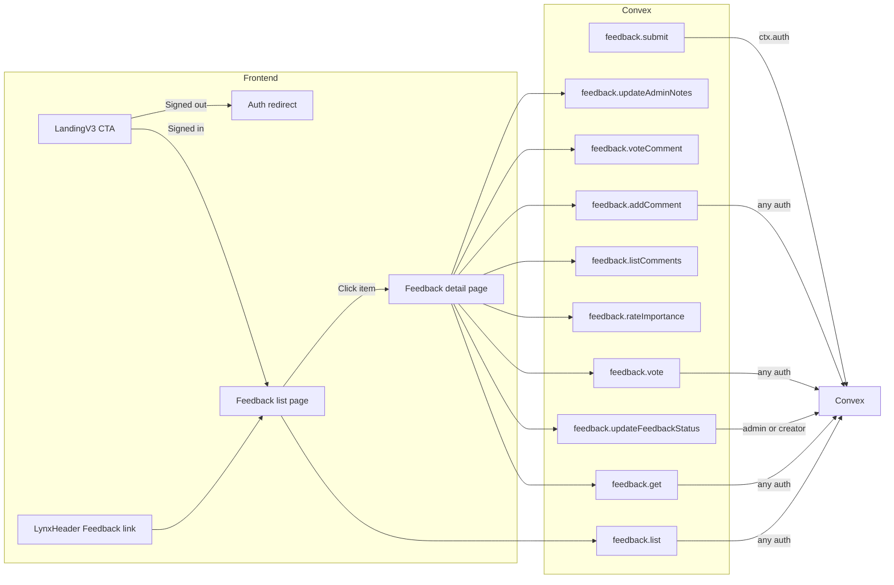

# Feedback Feature — End-to-End Implementation Plan

## Goals

- **Submit**: Any authenticated user can submit a feature request or bug report with a distinct **title** and **description**.
- **Discover**: Feature is marketed on the landing page and easy to find in the app.
- **Visibility**: **All authenticated users** can see the list of existing feedback and open any item's detail. This reduces duplicate submissions and saves admin time.
- **Engage**: Users can **upvote/downvote** feedback items and **rate importance** ("How important is this to you?"). This surfaces the most wanted features.
- **Edit permissions**: Only **admins** and the **feedback creator** can edit the feedback entry's details and/or status (and board). All other fields (e.g. admin notes) remain admin-only.
- **Feedback thread**: **All authenticated users** can comment on any feedback item. Comments support **voting (likes/dislikes)**, **threaded replies**, and **sorting** (Top comments / Newest).

## Architecture

- **List and detail**: All authenticated users open `/feedback` (list + "Submit new" CTA) and `/feedback/:id` (detail with comment thread). List uses `feedback.list`; detail uses `feedback.get`, `feedback.listComments`, `feedback.addComment`. Edit status/details only if admin or creator; `feedback.updateFeedbackStatus` and `feedback.updateAdminNotes` enforce this (adminNotes: admin only).
- **Submit**: Same as before; unauthenticated users are redirected to sign-in with return URL `/feedback`.

---

## 1. Convex: schema and feedback API

**Schema** ([convex/schema.ts](convex/schema.ts))

- **feedback** table:
  - `clerkUserId: v.string()`, `name: v.optional(v.string())`, `email: v.optional(v.string())`
  - `title: v.string()` — short summary displayed as the card heading and detail page title.
  - `description: v.string()` — full description/body (replaces the old single `message` field).
  - `board: v.union(v.literal("feature_request"), v.literal("bug_report"))` — categorizes the feedback. Displayed as "Feature Request" or "Bug Report" with distinct icons/colors. Default: `"feature_request"`.
  - `status: v.union(v.literal("gathering_interest"), v.literal("planned"), v.literal("in_progress"), v.literal("complete"), v.literal("closed"))` — default `"gathering_interest"`. Matches the reference statuses. Editable by admin or creator.
  - `adminNotes: v.optional(v.string())` — internal notes; editable by admin only. Omitted from API response for non-admins.
  - `voteScore: v.number()` — denormalized net vote score (upvotes minus downvotes). Default 0. Updated by vote mutation. Used for sorting.
  - `commentCount: v.number()` — denormalized comment count. Default 0. Incremented by addComment. Displayed on list cards.
  - `createdAt: v.number()`
  - Indexes: `by_createdAt: ["createdAt"]`, `by_voteScore: ["voteScore"]`, `by_board: ["board"]`, `by_clerkUserId: ["clerkUserId"]`.
- **feedbackVotes** table (upvote/downvote tracking):
  - `feedbackId: v.id("feedback")`, `clerkUserId: v.string()`, `value: v.union(v.literal(1), v.literal(-1))` (1 = upvote, -1 = downvote).
  - Index: `by_feedback_user: ["feedbackId", "clerkUserId"]` — unique constraint enforced in mutation (one vote per user per feedback).
- **feedbackImportance** table (importance polling):
  - `feedbackId: v.id("feedback")`, `clerkUserId: v.string()`, `rating: v.union(v.literal("not_important"), v.literal("nice_to_have"), v.literal("important"), v.literal("essential"))`.
  - Index: `by_feedback_user: ["feedbackId", "clerkUserId"]` — one rating per user per feedback.
- **feedbackComments** table (feedback thread):
  - `feedbackId: v.id("feedback")`, `clerkUserId: v.string()`, `name: v.optional(v.string())`, `body: v.string()`, `createdAt: v.number()`
  - `parentId: v.optional(v.id("feedbackComments"))` — for threaded replies. `null`/absent = top-level comment.
  - `likeCount: v.number()` — denormalized like count. Default 0.
  - `dislikeCount: v.number()` — denormalized dislike count. Default 0.
  - Indexes: `by_feedbackId: ["feedbackId"]`, `by_feedbackId_createdAt: ["feedbackId", "createdAt"]`, `by_parentId: ["parentId"]`.
- **commentVotes** table (comment like/dislike tracking):
  - `commentId: v.id("feedbackComments")`, `clerkUserId: v.string()`, `value: v.union(v.literal(1), v.literal(-1))` (1 = like, -1 = dislike).
  - Index: `by_comment_user: ["commentId", "clerkUserId"]` — one vote per user per comment.

**New module** `convex/feedback.ts`

- **submit** (mutation): Auth required. Insert feedback with clerkUserId, name, email, **title**, **description**, board (default `"feature_request"`), status `"gathering_interest"`, voteScore 0, commentCount 0, createdAt.
- **list** (query, no args): **Any authenticated user**. Return all feedback: _id, clerkUserId, name, title, description (truncated on client), board, status, voteScore, commentCount, createdAt. Exclude adminNotes. Order by createdAt desc. Client applies sort mode (Trending/Top/New) and board filtering.
- **get** (query, args: `id: v.id("feedback")`): **Any authenticated user**. Return single feedback doc; **include adminNotes only if caller is admin** (check via requireAdmin or getMyRole). Also return the caller's existing vote (from feedbackVotes) and importance rating (from feedbackImportance) so the UI can highlight the user's current selections.
- **vote** (mutation, args: `feedbackId: v.id("feedback")`, `value: v.union(v.literal(1), v.literal(-1), v.literal(0))`): **Any authenticated user**. Upsert into feedbackVotes. value=0 removes the vote. Recalculate and patch `feedback.voteScore`. Enforces one vote per user via the `by_feedback_user` index.
- **rateImportance** (mutation, args: `feedbackId: v.id("feedback")`, `rating`): **Any authenticated user**. Upsert into feedbackImportance. One rating per user per feedback.
- **getImportanceSummary** (query, args: `feedbackId`): **Any authenticated user**. Return counts for each importance level for display on the detail page.
- **updateFeedbackStatus** (mutation, args: `id`, `status`): Require **admin OR creator** (identity.subject === doc.clerkUserId). Patch status. Helper: `requireAdminOrCreator(ctx, feedbackDoc)`.
- **updateAdminNotes** (mutation, args: `id`, `adminNotes`): **Admin only** (requireAdmin). Patch adminNotes.
- **listComments** (query, args: `feedbackId: v.id("feedback")`, `sortBy: v.optional(v.union(v.literal("top"), v.literal("newest")))`): **Any authenticated user**. Return comments for that feedback (feedbackId, clerkUserId, name, body, createdAt, parentId, likeCount, dislikeCount). Sort by `likeCount desc` when `sortBy === "top"`, else by `createdAt asc`. Also return the caller's existing vote for each comment (from commentVotes) so the UI can highlight liked/disliked state.
- **addComment** (mutation, args: `feedbackId: v.id("feedback")`, `body: v.string()`, `parentId: v.optional(v.id("feedbackComments"))`): **Any authenticated user**. Insert into feedbackComments; set name from identity; set likeCount 0, dislikeCount 0. Validates feedback doc exists. If `parentId` is provided, validates parent comment exists and belongs to the same feedbackId. Increment `feedback.commentCount`.
- **voteComment** (mutation, args: `commentId: v.id("feedbackComments")`, `value: v.union(v.literal(1), v.literal(-1), v.literal(0))`): **Any authenticated user**. Upsert into commentVotes. value=0 removes the vote. Recalculate and patch the comment's `likeCount`/`dislikeCount`. Enforces one vote per user via the `by_comment_user` index.
- **listMyFeedback** (query, no args): **Any authenticated user**. Return feedback items where `clerkUserId` matches the caller. Used for the "Your posts" sidebar section.

No full-text search in Convex; list remains client-side searchable (filter by title, description, name).

---

## 2. Feedback list page (all authenticated users)

**Route**: `/feedback` in [src/App.tsx](src/App.tsx). Auth required (redirect to sign-in with return URL `/feedback` if not signed in).

**Page** `src/pages/FeedbackPage.tsx` (or split into `FeedbackListPage` + submit form component):

- **Layout**: Same shell as other app pages (LynxHeader with `activePage="feedback"`, base-pattern background). **Two-column layout**: main content area (left, wider) and sidebar (right).
- **Guidelines banner**: At the top of the main column, a prominent info box with submission guidelines, e.g.:
  - "Feel free to submit feature requests and bug reports"
  - "1. Search before posting! Your feedback has likely been submitted already."
  - "2. If you have multiple features to request, please create separate requests for each."
  - "3. If submitting a bug, please select 'Bug Report' as the board."
- **Sort tabs**: Below the banner, a row of tab buttons: **Trending** (default), **Top**, **New**. These control the client-side sort:
  - **Trending**: Sort by a weighted score (e.g. `voteScore * recency_decay` or a simple hot-ranking formula combining votes and age).
  - **Top**: Sort by `voteScore` descending.
  - **New**: Sort by `createdAt` descending.
- **Search and filter bar**: Next to the sort tabs, a search input (client-side filter by title/description) and a **filter button** (funnel icon) that opens a dropdown to filter by status and/or board.
- **"Submit new feature/bug" CTA**: Prominent button (accent color) that opens a submit dialog/modal or navigates to a submit form. The form includes:
  - **Title** (text input, required)
  - **Description** (textarea, required)
  - **Board** selector: "Feature Request" or "Bug Report"
  - Submit button calling `api.feedback.submit`. On success: close modal, show success toast.
- **Feed cards**: Below the toolbar, show all feedback from `api.feedback.list`, rendered as **cards** (not a table). Each card contains:
  - **Status pill** at the top (colored badge: "Gathering Interest", "Planned", "In Progress", "Complete", "Closed").
  - **Title** (bold heading, clickable link to `/feedback/:id`).
  - **Description preview** (first ~2 lines, truncated with ellipsis).
  - **Board tag** at bottom-left (icon + "Feature Request" or "Bug Report").
  - **Comment count** at bottom-right (speech bubble icon + number from `commentCount`).
  - **Upvote/downvote control** on the right edge of each card: up arrow, vote score (number), down arrow. Clicking calls `api.feedback.vote`. Highlight the arrow if the user has already voted in that direction.
  - Entire card is clickable to navigate to `/feedback/:id`.
- **Right sidebar**:
  - **"Your posts"** section: Shows the current user's own feedback items (from `api.feedback.listMyFeedback`), with count and truncated titles. Each is a link to the detail page. Includes a "View all your activity" link that filters the main list to only the user's posts.
  - **Boards** section: List of boards ("View all posts", "Feature Request", "Bug Reports") as clickable filters. Clicking a board filters the main list to that board.
- **Empty state**: "No feedback yet" when list is empty; CTA remains for first submission.

---

## 3. Landing page: market the feature

**File**: [src/pages/LandingV3.tsx](src/pages/LandingV3.tsx).

- The beta section already says "We welcome feedback." Strengthen and make actionable:
  - Add a clear CTA: e.g. "Report a bug" or "Send feedback" that:
    - If **signed in**: link to `/feedback` (or open in same tab).
    - If **signed out**: use Clerk's SignInButton with `redirectUrl`/`fallbackRedirectUrl` to `/feedback` so after sign-in they land on the feedback page.
- Optional: add a short line under the CTA such as "Help us improve — report bugs and send feedback from your account."

Placement: in or next to the existing beta CTA block (around the "Lynx is currently in beta" box) so it's visible without scrolling excessively.

---

## 4. App entry point: Feedback in nav

**File**: [src/components/LynxHeader.tsx](src/components/LynxHeader.tsx).

- Extend `ActivePage` type to include `"feedback"` (and `"feedbackDetail"` if the header needs to highlight Feedback when on `/feedback/:id`).
- Add a **Feedback** link pointing to `/feedback`. Show for **all signed-in users**. Use same nav styling as "Procurement links" (`navButtonClasses`). No separate admin-only "Feedback list" — everyone uses the same list and detail.

---

## 5. Feedback detail page (all authenticated users, with comment thread)

**Route**: `/feedback/:id` in [src/App.tsx](src/App.tsx). Auth required (redirect if not signed in). Resolve `:id` to Convex feedback document id.

**Page** `src/pages/FeedbackDetailPage.tsx`:

- **Layout**: Same shell (LynxHeader, base-pattern). **Two-column layout**: main content (left, wider) and sidebar (right), matching the reference (title, description, then comment thread on the left; upvoters/status/board on the right).
- **Back link**: "Back to feedback" with left-arrow, linking to `/feedback`.
- **Left column (main)**:
  - **Title**: Prominent heading from the `title` field.
  - **Full description**: Full `description` in a readable block (border-accent card).
  - **Importance poll**: "How important is this to you?" section with 4 clickable options: "Not important", "Nice to have", "Important", "Essential" — each with a distinct color/icon. Clicking calls `api.feedback.rateImportance`. The user's current selection is highlighted. Optionally show aggregate counts from `api.feedback.getImportanceSummary` so users can see how others rated it.
  - **Similar posts** (v1 - simple): A "View all similar posts" expandable section showing other feedback items with the same board or keyword overlap in title. Each similar post is a clickable link. Uses client-side matching from the already-loaded feedback list, or a dedicated query. Collapsed by default.
  - **Submitted by**: Creator name (or email or "Unknown"), formatted date. Visible to all authenticated users for context.
  - **Comment section header**: "Comments (N)" count with a tab/toggle for **"Top comments"** vs **"Newest"** sort order. The sort selection is passed to `api.feedback.listComments({ feedbackId, sortBy })`.
  - **"Write a comment"** input area:
    - Textarea with placeholder "Write a comment..."
    - **Formatting toolbar** below the textarea: bold (B), italic (I), list, link, emoji buttons. v1 can use a lightweight rich-text approach (store markdown in `body`, render with a markdown renderer) or start with plain text and add formatting later.
    - "Comment" submit button (accent color). On submit call `api.feedback.addComment({ feedbackId, body })`. Clear input on success.
    - **All authenticated users** can comment; no admin/creator check.
  - **Comments list**: Render comments from `api.feedback.listComments`. Each comment shows:
    - **Avatar**: Colored circle with user initial or icon (generate from user name hash).
    - **Author name** (bold).
    - **Comment body** (full text, rendered as markdown if rich-text is supported).
    - **Like/dislike controls**: Thumbs-up icon + like count, thumbs-down icon. Clicking calls `api.feedback.voteComment`. Highlight if the user has already voted.
    - **"Reply" button**: Opens an inline reply input below the comment. Submits with `parentId` set to the comment's `_id`.
    - **"..." more options menu**: For the comment author: Edit, Delete. For admins: Delete. For others: hidden or Report (future).
    - **Nested replies**: If a comment has `parentId`, render it indented below its parent. v1 supports one level of nesting (replies to top-level comments only).
  - **Admin notes**: Section "Internal notes" (textarea + Save) **only visible to admins**. When visible, show existing adminNotes and call `updateAdminNotes` on save.
- **Right column (sidebar)**:
  - **Upvoters**: Up arrow, vote score, down arrow (same control as on list cards but larger). Clicking calls `api.feedback.vote`. Show the user's current vote state.
  - **Status**: Current status as pill. **Editable only if current user is admin OR creator** (compare `identity.subject` with `doc.clerkUserId` and `getMyRole?.role === "admin"`). When editable: dropdown or button group calling `updateFeedbackStatus`. When not editable: read-only pill.
  - **Board**: "Feature Request" or "Bug Report" as read-only pill with icon (or editable by admin/creator if we add `updateFeedbackBoard`).
  - **Subscribe to post** (v1 - UI only): "Get notified by email when there are changes" with a "Get notified" toggle button. Stores subscription in a `feedbackSubscriptions` table. Actual email notifications are a follow-up, but the subscription toggle can be wired up now for future use.
- **Data**: `useQuery(api.feedback.get, { id })` and `useQuery(api.feedback.listComments, { feedbackId: id })`. Loading and "Not found" (invalid id) with link back to `/feedback`. Pass `clerkUserId` from doc and current user identity so the UI can show/hide edit controls for status (and admin notes for admins only).
- **Accessibility**: Back link and comment form properly labeled; status control when editable is keyboard-friendly; vote buttons have aria-labels.

---

## 6. Files to add or change (summary)

| Area                                                           | Action                                                                                                                                                                                                                                                                                                                                     |
| -------------------------------------------------------------- | ------------------------------------------------------------------------------------------------------------------------------------------------------------------------------------------------------------------------------------------------------------------------------------------------------------------------------------------ |
| [convex/schema.ts](convex/schema.ts)                           | Add **feedback** table (with title, description, board, voteScore, commentCount), **feedbackVotes**, **feedbackImportance**, **feedbackComments** (with parentId, likeCount, dislikeCount), **commentVotes**. Indexes as in section 1.                                                                                                     |
| **convex/feedback.ts**                                         | **Add** – submit, **list**, **get** (with caller's vote + importance), **vote**, **rateImportance**, **getImportanceSummary**, **updateFeedbackStatus** (admin or creator), **updateAdminNotes** (admin only), **listComments** (with sort + caller's comment votes), **addComment** (with parentId), **voteComment**, **listMyFeedback**. |
| [src/App.tsx](src/App.tsx)                                     | Add route `/feedback` (auth-aware list + submit) and `/feedback/:id` (auth-aware detail). No admin-only feedback routes.                                                                                                                                                                                                                   |
| **src/pages/FeedbackPage.tsx**                                 | **Add** – Two-column: main (guidelines banner, sort tabs, search/filter bar, submit CTA, feed cards with upvote controls + comment counts) and sidebar ("Your posts" + Boards filter).                                                                                                                                                     |
| **src/pages/FeedbackDetailPage.tsx**                           | **Add** – Two-column: main (title, description, importance poll, similar posts, comment thread with voting/replies/sorting) and sidebar (Upvoters, Status, Board, Subscribe).                                                                                                                                                              |
| [src/pages/LandingV3.tsx](src/pages/LandingV3.tsx)             | Add CTA "Report a bug" / "Send feedback" in or near beta section; link to `/feedback` when signed in, or sign-in with return URL `/feedback` when not.                                                                                                                                                                                     |
| [src/components/LynxHeader.tsx](src/components/LynxHeader.tsx) | Add "Feedback" link to `/feedback` for all signed-in users. Extend ActivePage with `"feedback"` (and optionally `"feedbackDetail"` when on detail).                                                                                                                                                                                        |

---

## 7. Auth and redirect details

- **/feedback** and **/feedback/:id**: Both require authentication. Use an `AuthenticatedRoute` that redirects to `/` or `/welcome` if not signed in; preserve return URL so after sign-in the user lands on the page they tried to open.
- **Clerk**: Use `SignInButton`'s `fallbackRedirectUrl={"/feedback"}` (or equivalent) when prompting sign-in from the landing CTA so that after sign-in the user lands on `/feedback`.

---

## 8. Style conventions (recap)

- Reuse **LynxHeader**, **base-pattern** background, **border-accent** tables, **uppercase** headings, **Button** with `variant="outline"` and `className` with `uppercase font-semibold` where appropriate.
- Use **text-foreground**, **text-muted-foreground**, **text-primary**, **text-destructive** for state and hierarchy.
- Form inputs: **Input** and **textarea** with consistent border/ring classes used in SystemPromptForm/ProcurementGrid.
- **Status pill colors**: Map each status to a distinct color — e.g. "Gathering Interest" (teal/cyan), "Planned" (blue), "In Progress" (amber), "Complete" (green), "Closed" (gray/muted).
- **Vote controls**: Styled as subtle up/down arrow buttons with the score between them. Active state (user has voted) uses accent/primary color.
- **Comment avatars**: Colored circles with user initial, generated deterministically from user name or ID.

---

## 9. Optional follow-ups (out of scope for v1 but noted)

- **Rich-text comment editor**: Full WYSIWYG toolbar (image upload, media embeds, attachments). v1 starts with plain text or basic markdown.
- **Email notifications**: Notify admins on new feedback, notify subscribers on status changes (Convex action + Resend). The "Subscribe to post" UI can be wired up in v1 with the notification delivery added later.
- **Activity feed tab**: A second tab on the detail page (alongside "Comments") showing a timestamped log of status changes, edits, and other activity.
- **Pagination / infinite scroll**: On the list page if feedback volume grows large.
- **Server-side search**: Filter by title/description prefix in Convex if client-side filter becomes slow.
- **Comment editing and deletion**: Allow comment authors to edit/delete their own comments; allow admins to delete any comment.
- **Similar posts (enhanced)**: Server-side keyword or embedding-based similarity matching, rather than simple client-side title overlap.
- **Board management**: Admin ability to create/rename boards beyond the two defaults.

This plan delivers: schema + API (feedback, feedbackVotes, feedbackImportance, feedbackComments, commentVotes), a full list page with sort tabs, board filtering, search, upvoting, and "Your posts" sidebar at `/feedback`, a detail page at `/feedback/:id` with importance polling, comment thread (with voting, replies, sorting), and conditional edit (status for admin/creator; admin notes for admin only) — all in Lynx style.