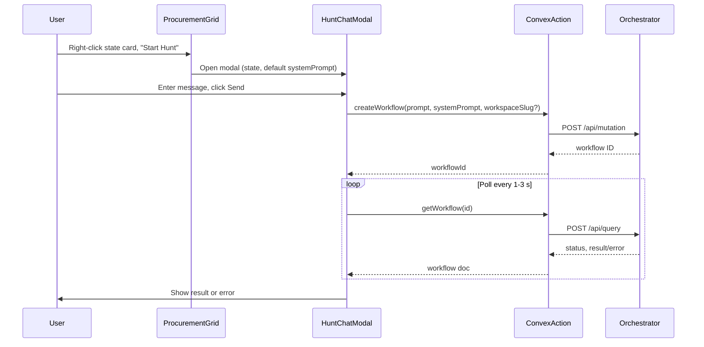

# Orchestrator integration – full implementation plan

## Current state

- **Start Hunt** in [src/components/ProcurementGrid.tsx](src/components/ProcurementGrid.tsx) (context menu on state cards) currently runs `alert("this integration is not fully implemented yet")` and closes the menu (lines 434–437).
- **No chat modal** exists yet; the second image describes the desired UX: modal with system prompt selection, user message input, and Send.
- **Data available**: `contextMenu.state` when Start Hunt is clicked; `promptByState` (Map from state key to `chatSystemPrompts` doc with `systemPromptText`) is already computed in `ProcurementGrid`; system prompts are keyed by state and type (e.g. "leads").

Orchestrator contract is fully specified in [docs/INTEGRATION.md](docs/INTEGRATION.md): create workflow via `POST <BASE_URL>/api/mutation` with `path: "workflows:create"` and `args: { prompt, systemPrompt, workspaceSlug? }`, then poll `POST <BASE_URL>/api/query` with `path: "workflows:get"` and `args: { id }` until `status` is `completed`, `failed`, or `cancelled`.

---

## Architecture (industry best practices)

- **Do not send the orchestrator admin key from the browser.** Use a Convex **action** to call the orchestrator server-side; store base URL and auth key as **Convex env vars** (so the same code works with the local Convex backend). The auth variable is `**HYDRA_KEY`**; the action sends it as `Authorization: Convex <HYDRA_KEY>`. The frontend only calls Convex actions.
- **Single responsibility**: one small API module for orchestrator calls (inside the action), one UI component for the Hunt modal, and wiring in `ProcurementGrid`.

---

## 1. Configuration and environment

- **Convex env vars** (set in Convex dashboard or via `npx convex env set` so the **local Convex backend** can use them):
  - `**ORCHESTRATOR_BASE_URL`** (e.g. `https://your-orchestrator.example.com` or `http://192.168.1.10:3220`) — required.
  - `**HYDRA_KEY**` — the orchestrator auth key. Stored as a Convex env var (e.g. secret) so it is never sent from the browser. If set, the action sends header `Authorization: Convex <HYDRA_KEY>` (per INTEGRATION.md). Optional if the orchestrator does not require auth.
- **Document in `.env.example`** (or a short doc): that these Convex env vars must be set for the backend; no orchestrator keys in Vite env.

---

## 2. Convex action: orchestrator client

- **New file:** `convex/orchestrator.ts` (or `convex/actions/orchestrator.ts` if you prefer an `actions` folder).
- **Expose two actions:**
  - `**createWorkflow`**  
  Args: `{ prompt: string, systemPrompt: string, workspaceSlug?: string }`.  
  Inside the action: `POST process.env.ORCHESTRATOR_BASE_URL + "/api/mutation"` with body `{ path: "workflows:create", args: { prompt, systemPrompt, workspaceSlug }, format: "json" }` and optional `Authorization: Convex ${process.env.HYDRA_KEY}` (when `HYDRA_KEY` is set in Convex env).  
  Return: `{ workflowId: string }` (from response `value`) or throw on non-200 or `status !== "success"`.
  - `**getWorkflow`**  
  Args: `{ id: string }`.  
  Inside the action: `POST .../api/query` with body `{ path: "workflows:get", args: { id }, format: "json" }` and same optional `Authorization: Convex ${process.env.HYDRA_KEY}`.  
  Return: the workflow document (e.g. `{ status, result?, error?, logs? }`).
- **Error handling:** Map HTTP errors and orchestrator `status: "error"` / `errorMessage` to a clear thrown Error so the UI can show a user-friendly message.
- **Types:** Define minimal TypeScript types for request/response shapes used in the action (no need to type the full Convex schema unless you store workflow IDs in Convex later).

---

## 3. Hunt chat modal component

- **New file:** `src/components/HuntChatModal.tsx` (or `StartHuntModal.tsx`).
- **Props:**  
`open: boolean`, `onOpenChange: (open: boolean) => void`, `stateName: string`, `defaultSystemPrompt: string` (the `systemPromptText` for that state from `promptByState`; may be empty if no prompt configured).
- **UI (matching the second image):**
  - **State / system prompt:** Show the state name and a **system prompt** field: either read-only summary (e.g. first 100 chars + “(state prompt)”) or a textarea pre-filled with `defaultSystemPrompt` so the user can edit before sending. Use whichever fits your UX; INTEGRATION requires a `systemPrompt` string.
  - **User chat message:** A textarea (“User chat message”).
  - **Send button:** Disabled until the user has entered a non-empty message (and optionally until system prompt is non-empty if you require it).
- **Behavior on Send:**
  1. Call `createWorkflow` action with `prompt = userMessage`, `systemPrompt = chosen/edited system prompt`, `workspaceSlug` omitted (or optional later).
  2. Show a “Submitting…” / “Running…” state; then poll `getWorkflow(workflowId)` every 1–3 seconds (per INTEGRATION.md).
  3. Use returned `status` to show progress (e.g. “Validating…”, “Retrieving context…”, “Generating…”).
  4. When `status === "completed"`: show `result` in the modal (e.g. scrollable text or simple HTML-safe display).
  5. When `status === "failed"`: show `error` (and optionally `logs`).
  6. When `status === "cancelled"`: show a short “Cancelled” message.
  7. On network or action throw: show a generic error (e.g. “Could not reach orchestrator. Try again.”).
- **Accessibility:** Use existing `Dialog` from `@/components/ui/dialog`, labels, and focus management; keep keyboard (Escape to close, etc.).
- **Styling:** Reuse existing design tokens (e.g. `border-accent`, `bg-card`, primary button) so the modal matches the rest of the app.

---

## 4. ProcurementGrid wiring

- **State:** Add `huntModalOpen: boolean` and `huntModalState: string | null` (and optionally `huntModalDefaultPrompt: string`) to control the Hunt modal. Alternatively, pass `state` and default prompt only when opening (no need to store default prompt in state if you pass it when opening).
- **Start Hunt click:** In the context menu button’s `onClick`:
  - Set `huntModalState = contextMenu.state`.
  - Resolve default system prompt: `promptByState.get(stateKey(contextMenu.state))?.systemPromptText ?? ""`.
  - Set `huntModalOpen = true`, then `setContextMenu(null)`.
- **Render:** Render `HuntChatModal` with `open={huntModalOpen}`, `onOpenChange={setHuntModalOpen}`, `stateName={huntModalState ?? ""}`, `defaultSystemPrompt={...}` (from `promptByState.get(stateKey(huntModalState))` when opening or from state). When the modal closes, clear `huntModalState` if desired so the next open is fresh.

---

## 5. Optional enhancements (can be follow-ups)

- **workspaceSlug:** If the orchestrator team provides a mapping (e.g. state or region → workspace slug), add a dropdown or fixed mapping so `args.workspaceSlug` is sent when creating the workflow.
- **Persistence:** If you want to show “last run” or store workflow IDs, add a Convex table and have the action (or a mutation) store `workflowId`, `state`, `status`, `createdAt`; the modal can remain stateless for the first version.
- **Copy result:** A “Copy” button in the modal when `status === "completed`” to copy `result` to the clipboard.

---

## 6. Checklist (matches INTEGRATION.md)

- Obtain base URL and Hydra auth key (if required) and set as Convex env vars: `ORCHESTRATOR_BASE_URL` and `HYDRA_KEY`.
- Create workflow: frontend calls Convex action → action `POST /api/mutation` with `path: "workflows:create"`, `args: { prompt, systemPrompt, workspaceSlug? }`.
- Store returned workflow ID in modal state for polling.
- Poll via Convex action `getWorkflow` (`POST /api/query`, `path: "workflows:get"`, `args: { id }`) every 1–3 s until terminal status.
- Read and display `result` on success, `error` on failure.

---

## File summary

| Area    | File                                 | Purpose                                                                                                                  |
| ------- | ------------------------------------ | ------------------------------------------------------------------------------------------------------------------------ |
| Backend | `convex/orchestrator.ts`             | Actions `createWorkflow` and `getWorkflow` calling orchestrator API; Convex env `ORCHESTRATOR_BASE_URL` and `HYDRA_KEY`. |
| UI      | `src/components/HuntChatModal.tsx`   | Modal: system prompt display/edit, user message, Send; call actions and poll; show result/error.                         |
| UI      | `src/components/ProcurementGrid.tsx` | Open Hunt modal on Start Hunt with `state` and default system prompt; render `HuntChatModal`.                            |
| Config  | `.env.example` or docs               | Document Convex env vars `ORCHESTRATOR_BASE_URL` and `HYDRA_KEY` (so local Convex backend can run the integration).      |

No changes to Convex schema are required for the minimal integration; all orchestrator calls are done from the frontend through Convex actions.